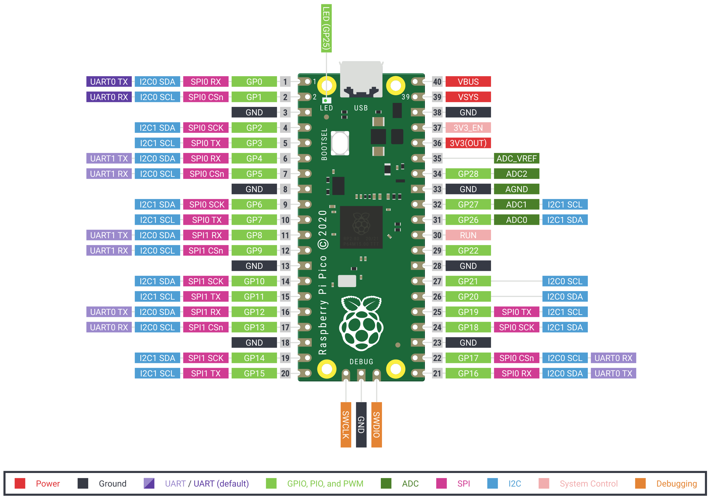

# pico
Raspberry Pi Pico experiments

https://www.raspberrypi.com/products/raspberry-pi-pico/

## Micropython

[Micropython examples](./micropython)

[Official Micropython Pico Guide (PDF)](./micropython/RPi_PiPico_Digital_v10.pdf)

Useful links:
- https://www.raspberrypi.com/documentation/microcontrollers/micropython.html
- https://projects.raspberrypi.org/en/projects/getting-started-with-the-pico
- https://github.com/raspberrypi/pico-micropython-examples
- https://docs.micropython.org/en/latest/index.html
- https://docs.micropython.org/en/latest/rp2/quickref.html

### Install Micropython

Holding the BOOTSEL button when powering up your board will put it into a special mode where it appears as a USB Mass Storage Device.
A drive called RPI-RP2 should pop up. Go ahead and drag the MicroPython [firmware.uf2](./micropython) file onto this drive. 
This programs the MicroPython firmware onto the flash memory on your Raspberry Pi Pico.

### Run Micropython programs

Use a serial terminal (like [puTTY](https://www.putty.org) at 115kBaud for directly accesing the Micropython REPL, then type "help()" and Enter.

Or install [Thonny](https://thonny.org), a Python IDE for beginners.

Alternatively, install ampy on your host: pip3 install adafruit-ampy
```
ampy -p COM5 ls                # to browse the filesystem
ampy -p COM5 put hobbes.pbm    # to upload a (binary) file
```

## How to build the C++ examples

Install the pico-sdk and set the environment variable PICO_SDK_PATH pointing there.

On Windows with "Developer Command Prompt for VS 2017" execute:
```
    mkdir build
    cd build
    cmake -G "NMake Makefiles" ..
    nmake
```

Alternatively, launch VisualStudio Code from this shell with the CMake Tools configured for "cmake.generator": "NMake Makefiles".

## Pin-Out

 
