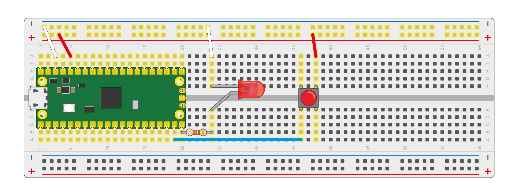
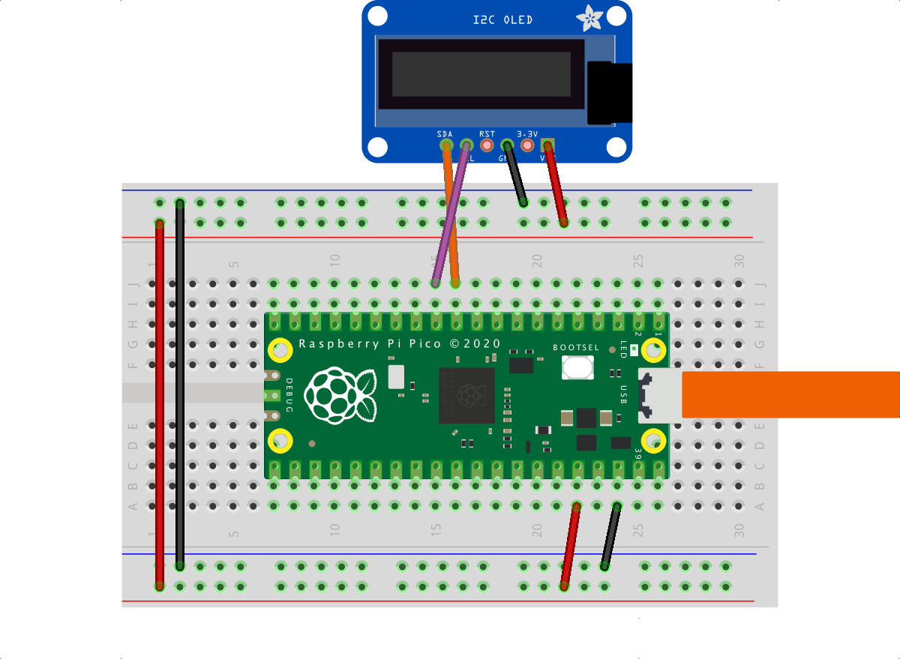

# Micropython for Pico

[Official Micropython Pico Guide (PDF)](./RPi_PiPico_Digital_v10.pdf)

Useful links:
- https://www.raspberrypi.com/documentation/microcontrollers/micropython.html
- https://projects.raspberrypi.org/en/projects/getting-started-with-the-pico
- https://github.com/raspberrypi/pico-micropython-examples
- https://docs.micropython.org/en/latest/index.html
- https://docs.micropython.org/en/latest/rp2/quickref.html

## Install Micropython

Holding the BOOTSEL button when powering up your board will put it into a special mode where it appears as a USB Mass Storage Device.
A drive called RPI-RP2 should pop up. Go ahead and drag the MicroPython [firmware.uf2](./micropython) file onto this drive. 
This programs the MicroPython firmware onto the flash memory on your Raspberry Pi Pico.

## Run Micropython programs

Use a serial terminal (like [puTTY](https://www.putty.org) at 115kBaud for directly accesing the Micropython REPL, then type "help()" and Enter.

For first steps, better install [Thonny](https://thonny.org), a Python IDE for beginners.

To access the Micropython filesystem, install ampy on your host: 
```
pip3 install adafruit-ampy
ampy -p COM5 ls                # to browse the filesystem
ampy -p COM5 put hobbes.pbm    # to upload a (binary) file
```
Or use rshell on your host:
```
pip3 install rshell
rshell                         # open rshell
>help
>boards
>ls -l /pyboard
>exit
```

# Examples and wiring

## Button and LED

[button.py](./button.py)

[led.py](./led.py)

 

## OLED Display

for SSD1306 or SH1107 with 128x64 pixels

[oled.py](./oled.py)

[ssd1306.py (driver)](./sh1107.py)

[sh1107.py (driver)](./sh1107.py)

 
